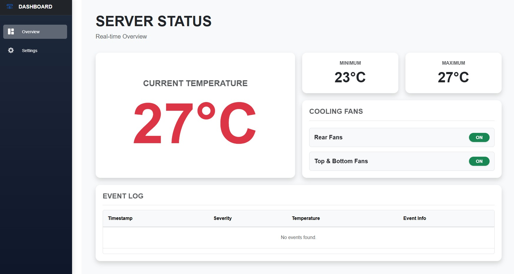
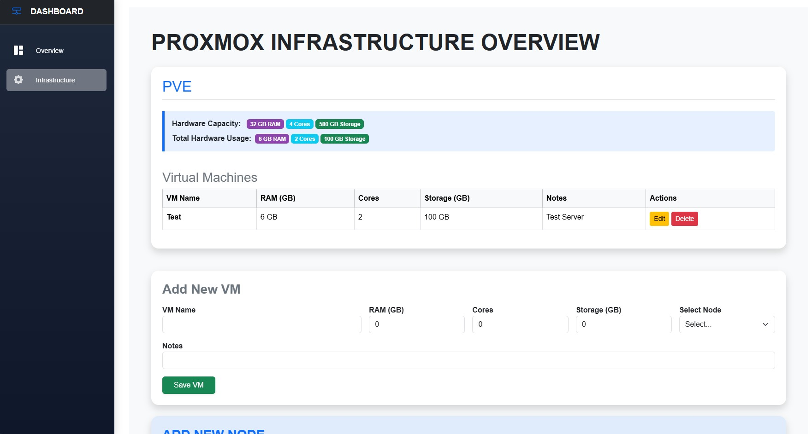

# ServerDashboard

Een geautomatiseerd monitorings- en koelingssysteem voor serverracks, aangedreven door een microcontroller (zoals een **BBC micro:bit v2**) en een gecontaineriseerde **.NET & SQL Server** applicatie stack.

Dit project stelt IT-beheerders in staat om realtime temperaturen uit te lezen en automatisch verschillende ventilatorgroepen (_Top Fans_ en _Bottom Fans_) aan te sturen op basis van configureerbare drempelwaarden. Via een overzichtelijk web-dashboard worden live statistieken, ventilatorstatussen en historische temperatuurevents bijgehouden.

---

> **BELANGRIJK: WERKT MET ALLE HARDWARE!**
> Hoewel we in dit voorbeeld een micro:bit v2 gebruiken, is dit dashboard **volledig hardware-onafhankelijk**.  
> **Zolang je:**
>
> 1. Een **Linux** server/pc gebruikt (voor de seriële poort).
> 2. De data insteekt op de juiste poort (`/dev/ttyACM0`).
> 3. Exact de juiste **JSON data** terugkrijgt vanuit je hardware.
>
> ...dan kan je dit dashboard met **ALLES** gebruiken! (Arduino, ESP32, Raspberry Pi Pico, etc.). Het dashboard blijft gewoon precies hetzelfde werken.

---

## 📑 Inhoudsopgave

- [📊 Dashboard Voorbeeld](#dashboard)
- [🚀 Kenmerken & Functionaliteiten](#kenmerken)
- [🔌 Hardware Benodigdheden](#hardware)
- [🛠️ Systeemarchitectuur](#architectuur)
- [⚙️ Installatie & Software-instructies](#installatie) _(Klik hier om direct naar de installatie te gaan)_
- [📟 Microcontroller Firmware & Code](#firmware)
- [📈 Logica Overzicht](#logica)

---

<a id="dashboard"></a>

## Dashboard Voorbeeld

Hieronder vind je een visuele weergave van de huidige status van het serverrack, inclusief actuele temperaturen, actieve ventilatoren en historische trendlijsten:




---

<a id="kenmerken"></a>

## Kenmerken & Functionaliteiten

- **Realtime Temperatuurmeting:** Continue monitoring via een ingebouwde of externe sensor.
- **Intelligente Trapsgewijze Koeling:**
  - Stand-by modus bij lage temperaturen (<= 23°C).
  - Activering van top fans bij gematigde warmte (>= 26°C).
  - Ingebouwde escalatietimer (10 minuten vertraging) om bottom ventilatoren bij te schakelen als de hitte aanhoudt.
  - Directe noodkoeling (alle ventilatoren direct aan) bij kritieke hitte (>= 30°C).
- **Gecontaineriseerde Architectuur:** Volledig geïsoleerde database-, API- en Client-omgeving via Docker Compose.
- **Hardware Pass-through:** Directe seriële communicatie (`/dev/ttyACM0`) tussen de Linux host-machine, de hardware-controller en de backend-container via JSON-streams.
- **Event Logging:** Opslag van statuswijzigingen en temperatuurverlopen in een SQL Server database voor trendanalyse.

---

<a id="hardware"></a>

## Hardware Benodigdheden

Om dit project te bouwen heb je de volgende fysieke componenten nodig:

1. **Linux Host-Machine (Vereist!):** Een pc, server of Raspberry Pi die op Linux draait (bijv. Ubuntu, Debian). _Let op: Windows of macOS wordt niet direct ondersteund omdat Docker daar geen directe USB pass-through (`/dev/ttyACM0`) toelaat._
2. **5V Ventilatoren:** Standaard **5V server/pc-ventilatoren** om je rack te koelen. Afhankelijk van de stroomvraag heb je mogelijk relais of transistoren nodig om ze veilig te schakelen.
3. **Microcontroller (bijv. BBC micro:bit v2):** Het brein dat de temperatuur meet en de ventilatoren aanstuurt.
4. **Breakout Board / Controller Shield:** (Als je een micro:bit gebruikt) Een uitbreidingsbordje waar je de micro:bit in kunt steken om de pinnen makkelijk te verbinden met je 5V ventilatoren.
5. **Micro-USB Kabel:** Om je microcontroller te verbinden met de Linux-server.

---

<a id="architectuur"></a>

## Systeemarchitectuur & Componenten

Het systeem is opgebouwd uit drie onafhankelijke Docker-services die naadloos met elkaar communiceren:

1. **`db` (SQL Server 2022):** Slaat alle historische data, systeem-events en temperatuurmetingen op.
2. **`api` (.NET Core Web API):** Luistert naar de seriële poort (`/dev/ttyACM0`), parseert de binnenkomende JSON-data, slaat gegevens op in de database en serveert endpoints voor de frontend.
3. **`client` (.NET Blazor / Web App):** De frontend die de statistieken en events visueel presenteert aan de gebruiker.

---

<a id="installatie"></a>

## Installatie & Software-instructies

### 1. Software Vereisten

Zorg ervoor dat de volgende software is geïnstalleerd op je Linux host-machine:

- [Docker & Docker Compose](https://docs.docker.com/get-docker/)

### 2. Seriële Poort Rechten (Belangrijk!)

Omdat de API direct communiceert met de USB-poort, moet Docker toegang hebben tot dit apparaat. Zorg dat je hardware via USB is aangesloten (standaard herkend als `/dev/ttyACM0` op Linux). Voer het volgende commando uit op je host-systeem om de juiste lees- en schrijfrechten te verlenen:

```bash
sudo chmod 666 /dev/ttyACM0
```

### 3. Omgevingsvariabelen (.env)

Maak in de hoofdmap van het project (naast de `docker-compose.prod.yml`) een bestand aan genaamd `.env`. Dit bestand bevat het veilige wachtwoord voor je SQL Server database.

Inhoud van `.env`:

```env
SA_PASSWORD=JouwSterkWachtwoord123!
```

### 4. Applicatie Starten

Start de gehele stack op met Docker Compose. Het systeem zal automatisch de databaseschema's initialiseren en de applicaties compileren.

```bash
docker compose -f docker-compose.prod.yml up --build -d
```

Controleer of alle containers correct draaien:

```bash
docker compose ps
```

De applicatie is nu bereikbaar via:

- **Frontend Dashboard:** http://localhost:5000
- **Backend API Swagger:** http://localhost:5050/swagger

---

<a id="firmware"></a>

## Micro:bit (v2) Firmware & Code

Als je de BBC micro:bit v2 gebruikt, is de firmware geschreven in TypeScript (MakeCode).

### Pin-Mapping & Hardware Aansluitingen

De micro:bit stuurt relais of 5V ventilatoren aan via de volgende digitale pinnen op het Breakout Board:

- **P0 & P16:** Aansturing van de **Top Fans** (Uitlaat / bovenzijde).
- **P8 & P12:** Aansturing van de **Bottom Fans** (Intake / onderzijde).

### De Micro:bit Code

Flash de onderstaande code naar je micro:bit via de [MakeCode Editor](https://makecode.microbit.org/):

```typescript
let temp = 0;
let statusTopFans = "OFF";
let statusBottomFans = "OFF";

let timerActive = false;
let bottomActive = false;
let startTime = 0;

const WAIT_TIME = 600000;

const checkFans = (temp: number) => {
  if (temp >= 30) {
    activateTopFans();
    activateBottomFans();

    statusTopFans = "ON";
    statusBottomFans = "ON";

    bottomActive = true;
  } else if (temp > 23) {
    if (temp >= 26) {
      activateTopFans();
      statusTopFans = "ON";

      if (!timerActive && !bottomActive) {
        timerActive = true;
        startTime = input.runningTime();
      }

      if (timerActive) {
        if (input.runningTime() - startTime >= WAIT_TIME) {
          activateBottomFans();
          statusBottomFans = "ON";

          bottomActive = true;
          timerActive = false;
        }
      }
    } else {
      deactivateTopFans();
      statusTopFans = "OFF";
    }

    if (bottomActive) {
      activateBottomFans();
      statusBottomFans = "ON";
    } else {
      deactivateBottomFans();
      statusBottomFans = "OFF";
    }
  } else {
    timerActive = false;
    bottomActive = false;

    deactivateTopFans();
    deactivateBottomFans();

    statusTopFans = "OFF";
    statusBottomFans = "OFF";
  }

  serial.writeLine(
    JSON.stringify({
      temp: temp,
      topfans: statusTopFans,
      bottomfans: statusBottomFans,
    }),
  );
};

const activateBottomFans = () => {
  pins.digitalWritePin(DigitalPin.P8, 1);
  pins.digitalWritePin(DigitalPin.P12, 0);
};

const activateTopFans = () => {
  pins.digitalWritePin(DigitalPin.P0, 1);
  pins.digitalWritePin(DigitalPin.P16, 0);
};

const deactivateBottomFans = () => {
  pins.digitalWritePin(DigitalPin.P8, 0);
  pins.digitalWritePin(DigitalPin.P12, 0);
};

const deactivateTopFans = () => {
  pins.digitalWritePin(DigitalPin.P0, 0);
  pins.digitalWritePin(DigitalPin.P16, 0);
};

basic.forever(function () {
  temp = input.temperature() - 2;
  basic.showNumber(temp);
  checkFans(temp);
  basic.pause(60000);
});
```

### Datastructuur (JSON Telemetrie)

Ongeacht welke microcontroller je gebruikt, deze moet elke minuut (of seconde) een JSON string via de seriële USB-verbinding naar de Linux poort (`/dev/ttyACM0`) sturen.

Het vereiste JSON-pakket ziet er exact zo uit:

```json
{
  "temp": 27,
  "topfans": "ON",
  "bottomfans": "OFF"
}
```

#### JSON Velden Toelichting:

- **`temp`** _(Integer)_: De actuele gemeten temperatuur in graden Celsius (incl. eventuele kalibratiecorrectie).
- **`topfans`** _(String: `"ON"` / `"OFF"`)_: De operationele status van de ventilatoren aan de bovenkant.
- **`bottomfans`** _(String: `"ON"` / `"OFF"`)_: De operationele status van de ventilatoren aan de onderkant.

---

<a id="logica"></a>

## Logica Overzicht (Temperatuurgedrag)

| Temperatuur (T)      | Top Fans Status | Bottom Fans Status | Gedrag & Logica                                                                                                                                               |
| -------------------- | --------------- | ------------------ | ------------------------------------------------------------------------------------------------------------------------------------------------------------- |
| **T <= 23°C**        | `OFF`           | `OFF`              | **Systeem is koel.** Alle ventilatoren staan uit. Timers en active-statussen worden gereset.                                                                  |
| **23°C < T < 26°C**  | `OFF`           | `OFF` of `ON`      | **Licht verhoogd.** Top fans gaan uit. Bottom fans blijven enkel aan als ze al actief waren (_hysteresis / statusbehoud_).                                    |
| **26°C <= T < 30°C** | `ON`            | `ON` _(na 10 min)_ | **Warm.** Top fans gaan direct aan. Er start een timer van 10 minuten (`600000 ms`). Blijft de temp al die tijd >= 26°C? Dan schakelen ook de Bottom fans in. |
| **T >= 30°C**        | `ON`            | `ON`               | **Kritiek warm.** Alle beschikbare ventilatorgroepen (Top & Bottom) schakelen onmiddellijk in voor maximale luchtstroom. Timer wordt genegeerd.               |

---

## Toekomstige Uitbreidingen (Work in Progress)

Dit project is volop in ontwikkeling. Geplande features voor volgende releases zijn:

- [ ] **Handmatige Overrides:** De mogelijkheid om via de webinterface ventilatoren geforceerd aan of uit te zetten (tweeweg seriële communicatie).
- [ ] **E-mail & Webhook notificaties:** Automatische waarschuwingen sturen naar systeembeheerders wanneer de temperatuur langer dan 15 minuten boven de 30°C blijft.
- [ ] **Uitgebreide Grafieken:** Integratie van historische datavisualisatie met Zoom-opties over specifieke dagen of weken.
- [x] **Infrastructuur overzicht:** Een overzicht van welke server specs je hebt en aangemaakte VM's en/of containers.
